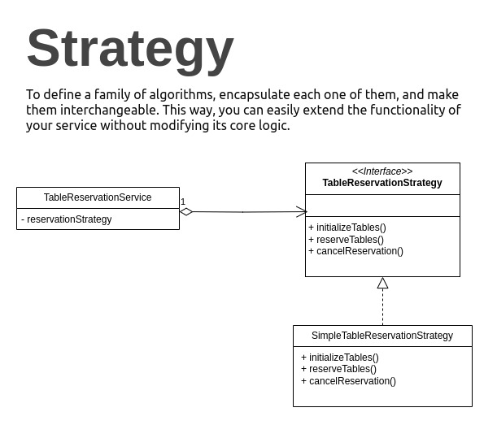

# Online Booking Application

## Overview
This project addresses the challenge of online table booking for restaurants. It begins with a meticulous outlining of requirements and the design of an API. Leveraging open APIs, a basic version is created, followed by the integration of a code generator to expedite development. Test-Driven Development (TDD) principles are applied to ensure smooth operation and appropriate testing.

## Key Features
- API-First Approach: The development process prioritizes API design, fostering collaboration between designers and developers while streamlining workflow.

- Parallel Development: The API-first methodology enables simultaneous work by designers and developers, enhancing efficiency and reducing time-to-market.

- Robust Documentation: OpenAPI documentation is provided for clear understanding and seamless integration of the application.


## Docker Instructions

### Required Software
- Docker: [Download Docker](https://docs.docker.com/get-docker/)

### Usage
1. Run the following Docker command to deploy the application:
```Shell
docker run -p 8080:8080 taaesan/table-booking-service:latest
```
2. Once the application is running, you can access the OpenAPI documentation at:  
http://localhost:8080/swagger-ui/index.html  

## Maven Instructions  

### Required Software
Java 17:[ Download JDK 17](https://www.oracle.com/java/technologies/javase/jdk17-archive-downloads.html)  
Maven 3.9+: [Download Maven](https://maven.apache.org/download.cgi)

### Usage
1. Navigate to the 'table-booking-service' directory:
```Shell
cd table-booking-service
```  

2. Install the project dependencies and execute unit tests using the following command:  
```Shell
mvn clean install
```  

3. To run the application:  
```Shell
mvn spring-boot:run
```

4. Once the application is running, you can access the OpenAPI documentation at:  
http://localhost:8080/swagger-ui/index.html  


---
### APIs Contract

| Operation  | Resource | HTTP Verb | Success Code | Error Code |
| ------------- | ------------- | ------------- | ------------- | ------------- |
| Initialize Tables | /initializeTables | POST | 200  | 409 - Tables already initialized | 
| Reserve Tables | /reserveTable | POST | 200  | 400 - Not enough tables for all customers <br>  503 - Not enough tables for all customers | 
| Cancel Reservation | /cancelReservation | POST | 200  | 404 - Booking ID not found | 

### Service Layer




## Kubernetes Instructions  

### Prosgre on K8
https://www.digitalocean.com/community/tutorials/how-to-deploy-postgres-to-kubernetes-cluster


```Shell
kubectl exec -it postgres-65db968757-hqmsk -- psql -h localhost -U ps_user --password -p 5432 ps_db

```


Install ingress controller (Minikube)
https://kubernetes.github.io/ingress-nginx/deploy/#minikube


mvn package -Dmaven.test.skip=true 
docker build -t taaesan/table-booking-service-k8:0.0.1 .
docker tag taaesan/table-booking-service-k8:0.0.1 taaesan/table-booking-service-k8:latest

docker push taaesan/table-booking-service-k8:0.0.1
docker push taaesan/table-booking-service-k8:latest

