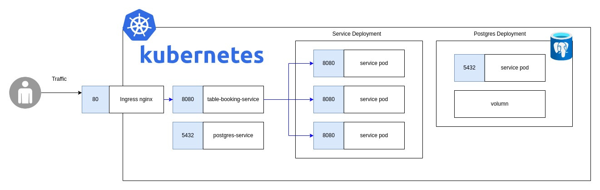

# Online Booking Application

## Overview
This project addresses the challenge of online table booking for restaurants. It begins with a meticulous outlining of requirements and the design of an API. Leveraging open APIs, a basic version is created, followed by the integration of a code generator to expedite development. Test-Driven Development (TDD) principles are applied to ensure smooth operation and appropriate testing.

## Key Features
- API-First Approach: The development process prioritizes API design, fostering collaboration between designers and developers while streamlining workflow.

- Parallel Development: The API-first methodology enables simultaneous work by designers and developers, enhancing efficiency and reducing time-to-market.

- Robust Documentation: OpenAPI documentation is provided for clear understanding and seamless integration of the application.


## Folder Structure
- **client**: This directory contains client scripts for the Rest Client plugin in Visual Studio Code. These scripts may be used for testing RESTful APIs or making HTTP requests.

- **k6**: This directory contains testing scripts for load testing using the k6 library. k6 is a modern load testing tool that allows you to write and execute performance tests in JavaScript.

- **k8s**: This directory contains Kubernetes configuration files. These files define the deployment, service, and other resources required for deploying and managing the online booking application in a Kubernetes cluster.

- **resources**: This directory contains miscellaneous resources related to the project. It may include documentation, design assets, or any other project-related materials.

- **table-booking-service**: This directory contains the backend service code for the online booking application. The backend service is written in Java with the Spring Boot framework. It includes server-side code, configuration files, tests, and other related resources specific to the table booking service.

## Docker Instructions

### Required Software
- Docker: [Download Docker](https://docs.docker.com/get-docker/)

### Usage
1. Run the following Docker command to deploy the application:
```Shell
docker run -p 8080:8080 taaesan/table-booking-service:latest
```
2. Once the application is running, you can access the OpenAPI documentation at:  
http://localhost:8080/swagger-ui/index.html  

## Maven Instructions  

### Required Software
Java 17:[ Download JDK 17](https://www.oracle.com/java/technologies/javase/jdk17-archive-downloads.html)  
Maven 3.9+: [Download Maven](https://maven.apache.org/download.cgi)

### Usage
1. Navigate to the 'table-booking-service' directory:
```Shell
cd table-booking-service
```  

2. Install the project dependencies and execute unit tests using the following command:  
```Shell
mvn clean install
```  

3. To run the application:  
```Shell
mvn spring-boot:run
```

4. Once the application is running, you can access the OpenAPI documentation at:  
http://localhost:8080/swagger-ui/index.html  


---
### APIs Contract

| Operation  | Resource | HTTP Verb | Success Code | Error Code |
| ------------- | ------------- | ------------- | ------------- | ------------- |
| Initialize Tables | /initializeTables | POST | 200  | 409 - Tables already initialized | 
| Reserve Tables | /reserveTable | POST | 200  | 400 - Not enough tables for all customers <br>  503 - Not enough tables for all customers | 
| Cancel Reservation | /cancelReservation | POST | 200  | 404 - Booking ID not found | 


## Kubernetes Instructions  



### Required Software
- Minikube https://minikube.sigs.k8s.io/docs/start/
- Kubctl https://kubernetes.io/docs/tasks/tools/
- Helm https://github.com/helm/helm/releases
- K6 https://k6.io/docs/get-started/installation/
- Ingress https://kubernetes.github.io/ingress-nginx/deploy/#minikube

### Usage

1. Ensure successful execution of the following commands:
```Shell
minikube start  
minikube addons enable ingress  
minikube addons list 
|ingress| minikube | enabled ✅| Kubernetes|
```
2. Execute the following commands to set up the Postgres cluster:

```Shell
kubectl apply -f k8s/postgres-configmap.yaml
kubectl apply -f k8s/postgres-volumn.yaml
kubectl apply -f k8s/postgres-deployment.yaml
```

3. Deploy the application by executing the following commands:
```Shell
kubectl apply -f k8s/table-booking-service.yaml
kubectl apply -f k8s/ingress.yaml
```

## Miscellaneous

### Prostgres on K8
https://www.digitalocean.com/community/tutorials/how-to-deploy-postgres-to-kubernetes-cluster


```Shell
k exec -it postgres-65db968757-hqmsk -- psql -h localhost -U ps_user --password -p 5432 ps_db

\c <db-name> - Connect database
\l - List database
\d <table-name> - Describe table
\d+ <table-name> - More details
```

Install ingress controller (Minikube)
https://kubernetes.github.io/ingress-nginx/deploy/#minikube

```Shell
docker rmi -f $(docker images 'taaesan/table-booking-service-k8' -a -q)

mvn package -Dmaven.test.skip=true 
docker buildx build -t taaesan/table-booking-service-k8:latest .
docker push taaesan/table-booking-service-k8:latest

k roll out restart deployment 

docker tag taaesan/table-booking-service-k8:0.0.4 taaesan/table-booking-service-k8:latest

docker push taaesan/table-booking-service-k8:0.0.5
docker push taaesan/table-booking-service-k8:latest
```

### Load Test
`k6 run k6/script.k8s.js`  

